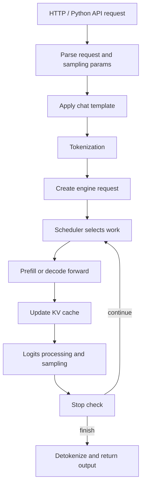

# 推理生命周期

LLM 推理服务的核心任务很简单：接收用户输入，持续预测下一个 token，再把 token 还原成文本。但工程系统里，这条链路会经过很多层：HTTP API、chat template、tokenizer、scheduler、KV cache、model runner、attention kernel、sampling、detokenizer、streaming response。理解这条生命周期，是后续阅读 vLLM 代码的第一把钥匙。

## 一条请求的主流程

以 chat completion 为例，一次请求大致会经历下面这些阶段：

这张图故意省略了多进程、分布式和设备细节。新人先抓住一件事：vLLM 不是“来一个请求就完整跑完一个请求”，而是在 engine 主循环里不断把多个请求的下一步工作混合调度到设备上执行。

## Request、Prompt、Token

用户看到的是文本和消息列表，模型看到的是 token ids。

- `messages`：OpenAI chat API 常见输入，例如 system/user/assistant/tool 多轮对话。
- `prompt`：经过 chat template 拼接后的模型输入文本，可能包含 role 标记和 special tokens。
- `token ids`：tokenizer 把 prompt 编码后的整数序列。
- `sampling params`：控制生成策略的参数，例如 temperature、top-p、max tokens、stop。
- `request state`：服务端为每个请求维护的运行状态，例如已生成 token 数、KV cache block、是否完成。

很多接口问题发生在模型 forward 之前。例如 template 用错会让模型看不懂 role，EOS 配错会导致提前停止或停不下来，工具调用 token 格式不对会导致 parser 异常。

## Prefill 阶段

Prefill 处理用户已有的 prompt。假设 prompt 长度是 2048，模型需要一次性处理这 2048 个 token，为每层 attention 生成对应的 K/V，并把它们写入 KV cache。

Prefill 的特点：

- 输入 token 多，通常是一个较长序列。
- attention 计算量较大，因为 prompt 内 token 之间需要做 causal attention。
- 会产生第一批 KV cache。
- 输出通常只需要最后一个位置的 logits，用来采样第一个 generated token。
- 对 TTFT 影响很大，prompt 越长，prefill 越耗时。

在服务系统里，prefill 往往是计算密集型阶段。长 prompt 会直接放大 prefill 计算量，高并发会让多个请求竞争调度和 KV cache 资源；chunked prefill、prefix caching 等机制，都是围绕这些 prefill 压力设计的优化手段。

## Decode 阶段

Decode 是增量生成。每一轮 decode 的输入是上一轮已经生成的 token；模型同时读取历史 KV cache，计算当前上下文下的 logits，并采样出下一个 token。随后，本轮输入 token 对应的 K/V 会追加到 KV cache，供下一轮使用。

Decode 的特点：

- 每个请求每步通常只新增 1 个 token。
- 需要反复读取历史 KV cache。
- 单步计算量比长 prompt prefill 小，但会执行很多轮。
- 常常受内存带宽、KV cache 布局、batching 和 kernel launch 开销影响。
- 对 TPOT、ITL 和总吞吐影响很大。

推理服务高吞吐的关键，不是让一个请求尽快独占跑完，而是让多个请求的 decode step 组成高效 batch。

## Sampling 和输出

模型 forward 的输出是 logits，也就是词表中每个 token 的分数。Sampling 会根据请求里的参数，从 logits 中选择一个 token 作为本轮生成结果。最简单的方式是 greedy decoding，也就是选择分数最高的 token；更常见的方式还包括 temperature、top-p、top-k 等，它们用于控制输出的随机性。

采样出 token 后，系统会检查请求是否应该结束，例如是否生成了 EOS token、是否达到最大输出长度、是否命中 stop 条件。如果请求还没结束，这个 token 会进入下一轮 decode；如果请求结束，系统会把 token ids 转回文本，并按 API 协议返回给用户。

大部分 sampling、detokenization、OpenAI API 输出处理逻辑由 vLLM 社区维护。vLLM Ascend 开发者通常只在模型特殊格式、兼容性 patch 或回归问题中接触这部分代码，因此这里先不展开复杂场景。这一阶段先掌握三件事即可：

- logits 是模型 forward 后的输出，不是最终文本。
- sampling 决定“下一个 token 选哪个”。
- detokenization 和 stop check 决定“输出什么文本、什么时候结束”。

如果你对“模型为什么会这样说话”感兴趣，可以继续了解这些方向：

- Sampling 参数如何影响风格：temperature、top-p、top-k、min-p 会改变输出的稳定性、多样性和创造性。
- Logits processor 如何改变候选 token：repetition penalty、bad words、guided decoding 会在采样前修改 logits。
- Stop condition 如何决定结束时机：EOS token、stop token、stop string、最大输出长度会共同影响请求何时结束。
- Structured outputs 如何约束格式：JSON schema、regex、grammar 等机制可以让模型输出更适合程序消费。
- Streaming 输出如何改善体验：用户不用等完整回答生成完，就可以逐步看到增量内容。

## 为什么需要 Scheduler

如果每个请求都单独跑，会出现两个问题。第一，设备利用率低，decode 每步只有少量 token。第二，不同请求长度差异很大，短请求会被长请求阻塞。

Scheduler 的职责是把许多请求组织成每一轮设备可执行的 batch。它会考虑：

- 当前有哪些 waiting/running requests。
- 本轮 token budget 还剩多少。
- KV cache block 是否够用。
- 哪些请求做 prefill，哪些请求做 decode。
- 是否允许 chunked prefill。
- 是否需要抢占、暂停或重算。

后续读 vLLM 时，可以把 scheduler 理解成“每个 engine step 的资源分配器”。

## 和 vLLM 代码的连接

- 请求入口：`$PATH_TO_VLLM/vllm/entrypoints/openai`
- V1 engine：`$PATH_TO_VLLM/vllm/v1/engine`
- 输入处理：`$PATH_TO_VLLM/vllm/v1/engine/input_processor.py`
- 调度器：`$PATH_TO_VLLM/vllm/v1/core/sched/scheduler.py`
- 输出处理：`$PATH_TO_VLLM/vllm/v1/engine/output_processor.py`
- tokenizer/chat template：`$PATH_TO_VLLM/vllm/transformers_utils`

## 常见误区

- 误区一：模型输入就是用户原始文本。实际模型看到的是经过 template 和 tokenizer 后的 token ids。
- 误区二：prefill 和 decode 只是名字不同。实际它们的计算形态、内存访问、调度策略都不同。
- 误区三：输出异常一定是模型或 kernel 问题。很多异常来自 chat template、sampling params、stop condition 或 detokenizer。
- 误区四：吞吐只取决于单次 forward 速度。推理服务吞吐还取决于 batching、KV cache、scheduler、网络和输出处理。

## 思考与探索

1. 找一个 chat completion 请求，写出它从 `messages` 到 `prompt` 再到 `token ids` 的变化过程。
2. 用自己的话解释 TTFT 为什么主要受 prefill 影响，TPOT 为什么主要受 decode 影响。
3. 在 vLLM 代码里找到 `scheduler.py`，只看类名和方法名，猜一猜哪些方法负责新增请求、调度请求、释放请求。

