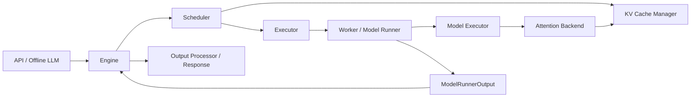

# vLLM 代码结构总览

读 vLLM 时，不建议从某个模型文件或某个 kernel 开始。更好的入口是一条请求主线：入口层接收请求，engine 管理状态，scheduler 分配每个 step 的 token budget，worker/model runner 执行模型，attention backend 读写 KV cache，output processor 组装输出。

这张图是阅读 vLLM 的骨架。后续章节只是不断把其中一个方块展开。

## 核心目录

- `$PATH_TO_VLLM/vllm/entrypoints`：对外入口，包括 OpenAI compatible server、CLI、offline inference 等。
- `$PATH_TO_VLLM/vllm/v1/engine`：V1 engine、engine core client、input/output processor、detokenizer。
- `$PATH_TO_VLLM/vllm/v1/core`：scheduler、KV cache manager、encoder cache manager、调度输出结构。
- `$PATH_TO_VLLM/vllm/v1/executor`：单进程、多进程、Ray 等执行器形态。
- `$PATH_TO_VLLM/vllm/v1/worker`：worker 和设备侧 model runner 的基础实现。
- `$PATH_TO_VLLM/vllm/v1/attention`：V1 attention backend 抽象和若干 backend 实现。
- `$PATH_TO_VLLM/vllm/model_executor`：模型定义、layer、model loader、sampling、attention layer 等。
- `$PATH_TO_VLLM/vllm/distributed`：并行状态、通信、KV transfer、EPLB 等分布式基础设施。
- `$PATH_TO_VLLM/vllm/v1/spec_decode`：投机推理的 V1 基础模块。
- `$PATH_TO_VLLM/docs/design`：设计文档，适合在读代码前先建立概念。
- `$PATH_TO_VLLM/docs/features`：功能文档，适合了解用户侧配置和支持范围。

## 推荐阅读顺序

1. 先看 `$PATH_TO_VLLM/vllm/entrypoints/openai` 和 `$PATH_TO_VLLM/docs/serving`，理解外部请求长什么样。
2. 再看 `$PATH_TO_VLLM/vllm/v1/engine`，理解请求如何进入 engine、输出如何返回。
3. 再看 `$PATH_TO_VLLM/vllm/v1/core`，重点理解 scheduler 和 KV cache manager。
4. 再看 `$PATH_TO_VLLM/vllm/v1/executor` 和 `$PATH_TO_VLLM/vllm/v1/worker`，理解控制面如何把调度结果交给设备侧。
5. 再看 `$PATH_TO_VLLM/vllm/model_executor` 和 `$PATH_TO_VLLM/vllm/v1/attention`，理解模型执行、attention backend 和 PagedAttention。
6. 最后再进入具体模型、具体 backend、graph、投机推理、分布式、KV transfer 等专题。

## 关键对象

下面这些名字在代码里可能有轻微组织变化，但代表的概念相对稳定：

- request：一次用户请求在 engine 内部的状态，包含 prompt tokens、输出 tokens、sampling params、状态和统计信息。
- scheduler output：一个 engine step 的调度结果，告诉 worker 哪些请求本轮要执行、每个请求执行多少 token、需要哪些 KV block 和 metadata。
- KV cache config：描述 KV cache 的形状、group、block size、dtype、cache spec 等信息。
- model runner output：设备侧执行后返回给 engine/scheduler 的结果，包括采样 token、logprobs、KV connector output、graph 统计等。
- attention metadata：attention backend 需要的运行时信息，例如 block table、slot mapping、sequence length、query length 等。

## 建议搜索关键词

这些关键词用于定位，不要求按固定方法或行号阅读：

- `EngineCore`
- `SchedulerOutput`
- `KVCacheManager`
- `ModelRunnerOutput`
- `AttentionBackend`
- `AttentionMetadata`
- `PagedAttention`
- `prefix cache`
- `cudagraph`
- `spec decode`

## 常见误区

- 误区一：vLLM 只是把多个请求拼成 batch。真实系统还要管理 KV cache、prefix cache、streaming、stop condition、graph、并行和分布式。
- 误区二：prefill 和 decode 是两个完全分离的系统。实际调度更像是“每个请求还差多少 token 没算完”，prefill、decode、chunked prefill 都会映射到每 step 的 token 分配。
- 误区三：attention backend 只负责矩阵乘。它还要理解 KV cache layout、block table、metadata、不同模型结构和平台能力。
- 误区四：读完一个模型文件就能理解 vLLM。模型文件只是执行链路的一部分，服务性能往往受 scheduler、KV cache 和 backend 共同影响。

## 思考与探索

1. 用自己的话画出“请求入口 -> scheduler -> worker -> output processor”的数据流。
2. 在 `$PATH_TO_VLLM/vllm/v1` 下只看目录名，判断哪些目录属于控制面，哪些目录属于执行面。
3. 用 `rg "SchedulerOutput"` 搜索它被哪些模块消费，观察 scheduler 和 worker 的边界。
