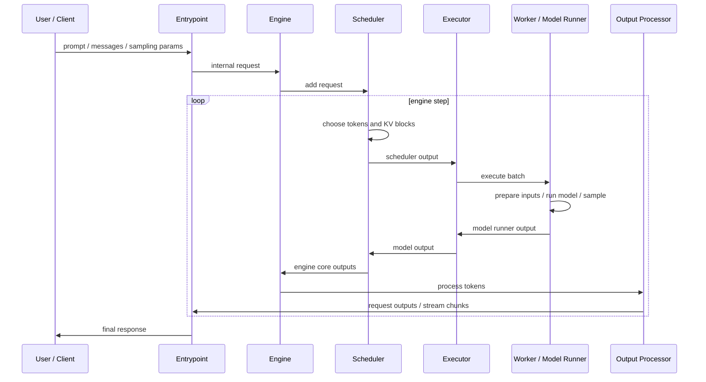

# vLLM V1 请求处理流程

本章用一次生成请求串起 V1 主流程。这里的目标不是记住某个函数名，而是理解每一层拿到什么、产出什么、交给谁。

## 端到端主线

这条链路中，scheduler 和 worker 是最容易混淆的两个角色：

- scheduler 决定“本轮算什么”：哪些请求、每个请求多少 token、需要哪些 KV block、哪些请求结束或释放。
- worker/model runner 决定“怎么在设备上算”：如何准备 input ids、positions、block table、attention metadata，如何执行模型和采样。

## 请求进入 engine

入口层处理完 tokenizer、chat template 和 sampling params 后，会构造内部请求。一个内部请求至少要携带：

- request id。
- prompt token ids。
- sampling 或 pooling 参数。
- 多模态输入或 encoder 输入信息。
- 到达时间、优先级、trace 信息等服务侧 metadata。
- LoRA、structured output、tool call 等可选配置。

engine 收到请求后，不会立即执行模型，而是把请求放入 scheduler 管理的状态中。之后每个 engine step 都由 scheduler 决定这批请求中哪些可以推进。

## 一个 engine step 做什么

一个 step 可以理解成一次“调度 + 执行 + 回收输出”的循环：

1. scheduler 查看 waiting/running 请求、token budget、KV cache 可用 block、prefix cache 命中、结构化输出约束等信息。
2. scheduler 生成 scheduler output，描述本轮要执行的 token 和请求状态变化。
3. executor 把 scheduler output 交给 worker。
4. worker/model runner 根据 scheduler output 更新本地请求状态、准备模型输入和 attention metadata。
5. 模型 forward，sampler 产生新 token。
6. model runner output 返回给 scheduler。
7. scheduler 更新请求状态、KV cache 状态、完成状态和统计信息。
8. output processor detokenize、检查 stop condition、组装用户可见输出。

如果本轮没有可执行 token，engine 仍可能需要处理 abort、释放、KV transfer、structured output 等状态变化。

## 关键对象流转

| 阶段 | 关注对象 | 作用 |
| --- | --- | --- |
| 入口层 -> engine | internal request | 保存 prompt、sampling params、多模态信息和服务 metadata |
| scheduler -> worker | scheduler output | 描述本轮要执行哪些 token、哪些请求新增或更新、KV block 如何使用 |
| worker 内部 | input batch / attention metadata | 把调度结果转换成模型和 backend 可消费的数据结构 |
| worker -> scheduler | model runner output | 返回采样 token、logprobs、KV connector 结果、执行统计 |
| scheduler -> output processor | engine core outputs | 更新请求状态，交给输出层 detokenize 和组装 API 输出 |

这些对象的具体字段会随版本演进，但它们代表的层间边界比较稳定。读代码时抓住“谁生产、谁消费、跨进程/跨设备传不传”会比记住字段名更有用。

## Prefill、Decode 和 Chunked Prefill 在流程中的位置

入口层不知道请求未来会被怎样切分。scheduler 根据请求当前已经计算到哪里、还剩多少 token、token budget 和 KV cache 状态，决定本轮推进多少 token。

- 一个新请求第一次推进 prompt，表现为 prefill。
- 一个已经有历史 KV 的请求每轮推进少量 token，表现为 decode。
- 一个很长 prompt 被拆成多轮推进，表现为 chunked prefill。

所以在 vLLM 的实现里，prefill/decode 更像 workload 形态，而不是完全独立的两套系统。

## 代码入口

- `$PATH_TO_VLLM/vllm/v1/engine`
- `$PATH_TO_VLLM/vllm/v1/core`
- `$PATH_TO_VLLM/vllm/v1/executor`
- `$PATH_TO_VLLM/vllm/v1/worker`
- `$PATH_TO_VLLM/vllm/v1/outputs.py`
- `$PATH_TO_VLLM/vllm/v1/request.py`

建议用对象名搜索当前版本的实现，例如 `EngineCoreRequest`、`SchedulerOutput`、`ModelRunnerOutput`、`RequestStatus`。这些是理解请求生命周期的好入口，但不要把某个方法名或行号当作长期固定的导航。

## 适合观察的现象

- 一个长 prompt 请求会不会在多个 step 中完成 prefill。
- 一个 decode 请求每轮通常调度几个 token。
- prefix cache 命中后，调度的 token 数和 KV block 分配有什么变化。
- 请求结束后，scheduler 和 worker 分别释放了哪些状态。
- streaming 输出和 engine step 是否一一对应。通常不是，因为 detokenization 和 stop string 可能改变输出节奏。

## 思考与探索

1. 为什么 scheduler output 需要区分“新调度的请求”和“已经在 worker 缓存过状态的请求”？
2. 如果模型 forward 已经返回 token，为什么还需要 output processor？
3. 画出一个 32K prompt 被 chunked prefill 的请求，在多个 engine step 中可能经历的状态变化。
