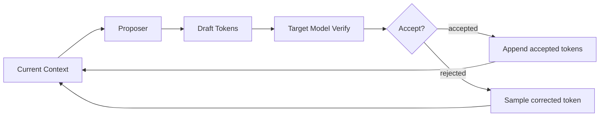

# vLLM 投机推理基础

投机推理的目标是降低 decode 的单 token 成本：先用较便宜的方式提出多个候选 token，再用目标模型一次性验证，从而在接受率足够高时减少目标模型的逐 token 调用次数。

本章只讲 vLLM 原生机制和通用概念，为后续 vLLM Ascend 的投机推理专题铺垫。

## 基本流程

一次投机推理通常包括：

1. proposer 根据当前上下文提出若干 draft token。
2. target model 对这些 token 进行验证。
3. rejection sampler 决定哪些 token 被接受。
4. 接受的 token 一次性推进请求状态；被拒绝的位置需要按目标模型分布修正。

如果 draft token 经常被接受，就可以提升吞吐；如果接受率低，额外 proposer 成本可能抵消收益。

## 常见方法

N-gram：从已有上下文中找重复片段作为候选。成本低，不需要额外模型，但适用场景有限。

Draft model：用一个较小模型生成候选 token。通用性较好，但需要额外模型权重和显存。

EAGLE：基于目标模型中间状态或轻量 head 预测后续 token，常用于减少额外模型成本。

MTP：模型自身带 multiple token prediction 能力时，可以直接提出多个 token。

Suffix speculative decoding：利用输入或上下文中的 suffix 匹配生成候选，适用于特定重复或模板化场景。

这些方法在 proposer 来源上不同，但都需要 target model 验证和接受/拒绝逻辑。

## 投机推理和 Scheduler

投机推理会改变 scheduler 和 worker 的信息量：

- 请求不再只是“下一步生成 1 个 token”，而可能有多个 draft token。
- scheduler 需要为 lookahead token 预留 KV cache。
- worker/model runner 需要把 draft token 放入本轮验证输入。
- output processor 需要处理一次返回多个 token 的情况。
- rejection sampler 会影响本轮最终接受几个 token。

这就是为什么投机推理不是单独加一个 proposer 就结束了，它会穿过 scheduler、KV cache、model runner、sampler 和输出处理。

## 关键指标

Acceptance rate：draft token 被目标模型接受的比例。越高越有利。

Draft length：每次提出多少 token。太短收益有限，太长可能浪费验证计算和 KV cache。

Target verify cost：目标模型一次验证多个 token 的成本。如果验证路径不高效，收益会下降。

Proposer cost：生成 draft token 的成本，包括额外模型、额外 forward、显存、通信等。

Memory overhead：draft model、EAGLE head、lookahead KV cache、额外 metadata 都可能增加显存。

End-to-end metrics：最终还是要看 TTFT、TPOT、吞吐、延迟分布和稳定性。

## 和 KV Cache 的关系

投机推理需要提前为 draft token 准备位置和 KV cache 空间。如果 token 被接受，这些 KV 可以继续使用；如果被拒绝，需要保证请求状态、KV cache、输出 token 和采样状态一致。

因此投机推理经常会暴露 KV cache 管理、slot mapping、position id、attention metadata 的边界问题。

## 和 Graph 的关系

投机推理可能让每轮 token 数更动态，也可能引入额外 proposer graph。Graph mode 下需要考虑：

- draft length 是否固定。
- target verify 的 shape 是否可捕获。
- proposer 和 target 是否都支持 graph。
- rejection sampler 是否有动态控制流。
- 接受 token 数变化如何反馈给 scheduler。

如果 graph 支持不完善，投机推理可能只能在 eager 或部分 graph 路径下运行。

## 代码入口

- `$PATH_TO_VLLM/vllm/v1/spec_decode`
- `$PATH_TO_VLLM/vllm/v1/worker`
- `$PATH_TO_VLLM/vllm/v1/sample`
- `$PATH_TO_VLLM/docs/features/speculative_decoding/README.md`
- `$PATH_TO_VLLM/docs/features/speculative_decoding/eagle.md`
- `$PATH_TO_VLLM/docs/features/speculative_decoding/mtp.md`
- `$PATH_TO_VLLM/docs/features/speculative_decoding/n_gram.md`
- `$PATH_TO_VLLM/docs/features/speculative_decoding/suffix.md`

建议搜索关键词：`spec decode`、`draft token`、`proposer`、`rejection sampler`、`acceptance rate`、`lookahead`。

## 常见问题定位

- 吞吐没有提升：看接受率、draft length、proposer 成本、target verify 路径。
- 精度或输出异常：看 rejection sampler、采样分布、token 接受/拒绝后的状态一致性。
- OOM：看 draft model、lookahead KV cache、额外 graph capture、batch 形态。
- 和 graph 冲突：看 shape 是否动态、proposer/target 是否都支持捕获。
- 某模型支持不好：看模型结构是否有 MTP/EAGLE 特殊实现，tokenizer 和 position 处理是否一致。

## 思考与探索

1. 为什么接受率低时，投机推理可能变慢？
2. 投机推理为什么会影响 KV cache manager？
3. 如果一个请求一次接受了 3 个 token，output processor 和 scheduler 状态需要怎样同步？
