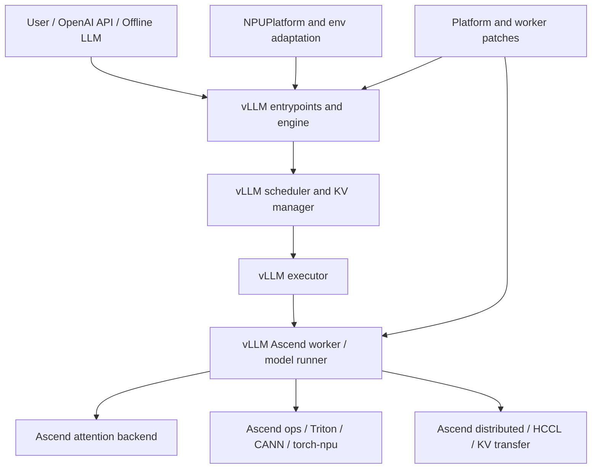
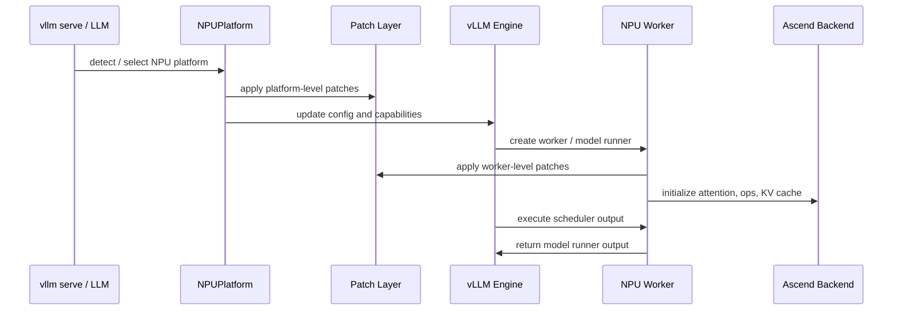

# vLLM Ascend 架构总览

vLLM Ascend 是 vLLM 的 Ascend NPU 后端适配层。它复用 vLLM 的服务入口、请求处理、调度和大部分模型执行抽象，在设备相关的位置接入 NPU platform、worker、attention backend、custom ops、分布式通信和必要 patch。

## 整体关系

可以把 vLLM Ascend 分成五类能力：

- Platform：告诉 vLLM 当前设备是 NPU，以及 NPU 支持哪些能力。
- Worker / Model Runner：把 scheduler output 转换成 NPU 可执行的 input batch、attention metadata 和模型执行流程。
- Attention / Ops：提供 NPU attention backend、自定义算子、Triton/CANN/aclnn 路径。
- Distributed：适配 HCCL、rank group、KV transfer、PD 分离、KV pool。
- Patch：在上游 vLLM 尚未提供稳定扩展点时，临时修补版本差异、模型特殊行为或 NPU 约束。

## 复用什么，适配什么

| 层级 | 通常来自 vLLM | vLLM Ascend 主要做什么 |
| --- | --- | --- |
| API / CLI | OpenAI server、offline API、CLI | 少量模型或输出兼容 patch |
| Engine | engine core、input/output processor | 必要时补兼容 patch |
| Scheduler | 通用调度框架、KV manager | 动态 batch、balance schedule、KV/CP 相关补丁 |
| Executor | 单进程、多进程、分布式执行抽象 | 适配 NPU worker 和分布式启动细节 |
| Worker / Model Runner | 通用 worker 边界 | NPU input batch、block table、graph、sampling、KV cache |
| Attention | backend 抽象 | Ascend dense attention、MLA、SFA、FA3、CP attention |
| Ops | layer 抽象和部分通用 op | torch-npu、Triton NPU、CANN/custom op、MoE 等 |
| Distributed | parallel state、KV connector 抽象 | HCCL、Mooncake、Ascend store、KV pool、UCM 等 |

## 启动到执行的粗流程

这个流程里，patch 的时机很重要：有些 patch 必须在 engine 或 config 初始化前生效，有些 patch 只需要在 worker 侧生效。

## 目录入口

- `$PATH_TO_VLLM_ASCEND/vllm_ascend/platform.py`：NPU platform 和全局能力声明。
- `$PATH_TO_VLLM_ASCEND/vllm_ascend/envs.py`：Ascend 相关环境变量。
- `$PATH_TO_VLLM_ASCEND/vllm_ascend/ascend_config.py`：Ascend 附加配置。
- `$PATH_TO_VLLM_ASCEND/vllm_ascend/worker`：NPU worker、model runner、block table、input batch。
- `$PATH_TO_VLLM_ASCEND/vllm_ascend/attention`：Ascend attention backend。
- `$PATH_TO_VLLM_ASCEND/vllm_ascend/ops`：NPU op、Triton op、MoE、RoPE、linear 等。
- `$PATH_TO_VLLM_ASCEND/vllm_ascend/distributed`：HCCL、parallel state、KV transfer。
- `$PATH_TO_VLLM_ASCEND/vllm_ascend/patch`：platform patch 和 worker patch。
- `$PATH_TO_VLLM_ASCEND/docs/source/developer_guide/Design_Documents`：设计文档。
- `$PATH_TO_VLLM_ASCEND/tests`：单测、e2e、nightly 测试。

## 常见误区

- 误区一：vLLM Ascend 是 vLLM 的完整 fork。实际上它更多是后端适配和扩展层。
- 误区二：所有问题都应该在 NPU kernel 层排查。很多问题发生在 config、patch、scheduler、KV cache 或 output processor。
- 误区三：patch 是随便改上游代码。好的 patch 应该有清晰原因、作用时机、测试和退出计划。
- 误区四：只看 worker 就能理解 Ascend 适配。attention、ops、distributed、platform 和 patch 同样关键。

## 思考与探索

1. 为什么 vLLM Ascend 可以复用 OpenAI entrypoint 和 engine？
2. 如果一个改动只影响 NPU attention kernel，理论上不应该改哪些层？
3. 画出你理解的 “scheduler output -> NPU model runner -> attention backend -> model runner output” 数据流。
