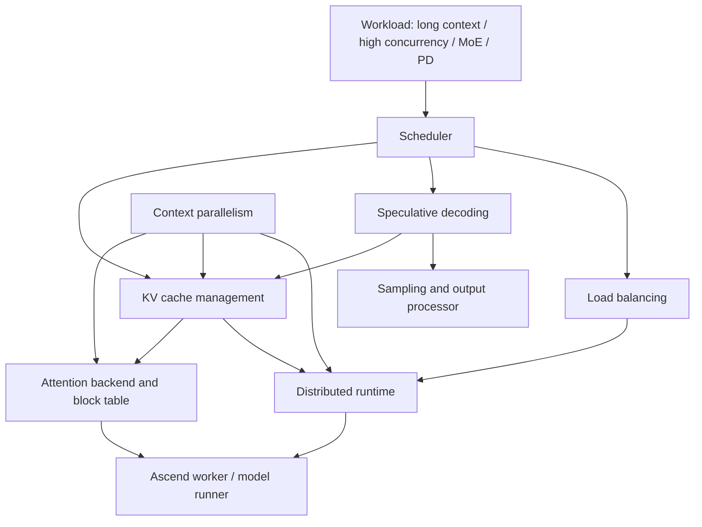

# 关键特性总览

本章关注团队当前最重要的四类特性：KV cache 管理、投机推理、CP 并行、负载均衡。它们看起来各自独立，但在真实服务里经常叠加出现。理解这些关系，比记住某个配置项更重要。

## 一张关系图

这张图表达的是：

- Scheduler 决定每轮推进哪些请求，是四类特性共同影响的入口。
- KV cache 管理是长上下文、高并发、prefix cache、PD 分离和投机推理的基础。
- CP 并行主要改变长序列下 attention 和 KV cache 的切分方式。
- 投机推理主要改变 decode 的推进粒度，同时影响 KV cache 预留、sampling 和输出处理。
- 负载均衡同时存在于请求级、实例级、PD 角色级、MoE expert 级。
- Worker/model runner 是这些决策落到 NPU 执行的汇合点。

## 四个特性分别解决什么

| 特性 | 主要问题 | 主要收益 | 主要风险 |
| --- | --- | --- | --- |
| KV cache 管理 | KV cache 显存压力、碎片、复用、跨实例传输 | 更高并发、更长上下文、更好的 PD/prefix cache 支撑 | block 不足、layout 不一致、transfer 失败 |
| 投机推理 | decode 每次只产出少量 token，目标模型调用频繁 | 接受率高时降低 TPOT、提升 decode 吞吐 | 接受率低、额外显存、状态一致性复杂 |
| CP 并行 | 长上下文 attention 和 KV cache 压力集中在单个 rank | 降低长序列 TTFT，缓解 decode KV duplication | 通信开销、rank 切分、metadata 复杂 |
| 负载均衡 | 请求长度、DP replica、PD 角色、MoE expert 负载不均 | 提升资源利用率，降低尾延迟 | 迁移开销、策略抖动、路由和缓存一致性 |

## 它们如何叠加

长上下文请求会同时压到 prefill、attention、KV cache 和调度。此时 CP 可以把长序列切到多个 rank 上，KV cache 管理负责按 block 保存和索引，scheduler 负责在长 prefill 和 decode 请求之间平衡。

PD 分离会把 prefill 和 decode 放到不同实例。此时 KV transfer 或 KV pool 负责把 prefill 产生的 KV 交给 decode，负载均衡负责让请求进入合适的 prefill/decode 实例，prefix cache 可能进一步减少重复 prefill。

MoE 模型会把 token 分发给不同 expert。此时 EP/EPLB 负责 expert 维度的负载均衡，DP 或外部负载均衡负责请求维度的分发，KV cache 和调度仍然决定每个实例内部能承载多少请求。

投机推理主要作用于 decode，但它会提前消耗 lookahead KV cache，并改变每轮验证 token 数。如果同时开启 graph、CP 或 PD，shape、metadata 和 KV 生命周期都要一起验证。

## 新人深入路线

如果你更关心长上下文和显存，建议按下面顺序读：

1. [KV Cache 管理](01-kv-cache-management.md)
2. [CP 并行](03-context-parallelism.md)
3. [性能观测与调优](../04-development-practice/02-observability-and-performance-tuning.md)

如果你更关心 decode 性能，建议读：

1. [投机推理](02-speculative-decoding.md)
2. [KV Cache 管理](01-kv-cache-management.md)
3. [调试手册](../04-development-practice/03-debugging-playbook.md)

如果你更关心大规模 MoE 服务，建议读：

1. [负载均衡](04-load-balancing.md)
2. [CP 并行](03-context-parallelism.md)
3. [测试、CI 与 Nightly Workflow](../04-development-practice/01-testing-ci-and-nightly.md)

## 常用测试入口

- KV cache / KV transfer：`$PATH_TO_VLLM_ASCEND/tests/ut/kv_connector`、`$PATH_TO_VLLM_ASCEND/tests/ut/worker/test_block_table.py`
- 投机推理：`$PATH_TO_VLLM_ASCEND/tests/ut/spec_decode`、`$PATH_TO_VLLM_ASCEND/tests/e2e/singlecard/spec_decode`
- CP：`$PATH_TO_VLLM_ASCEND/tests/ut/attention/test_attention_cp.py`、`$PATH_TO_VLLM_ASCEND/tests/ut/attention/test_common_cp.py`
- 负载均衡 / EPLB：`$PATH_TO_VLLM_ASCEND/tests/ut/eplb`

## 思考与探索

1. 为什么 KV cache 管理不是单纯的内存分配问题？
2. 一个特性提升平均吞吐后，为什么仍然可能让 p99 延迟变差？
3. 如果 CP、投机推理、PD 分离同时开启，最容易出错的共享边界在哪里？
