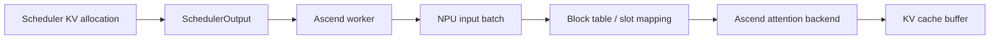
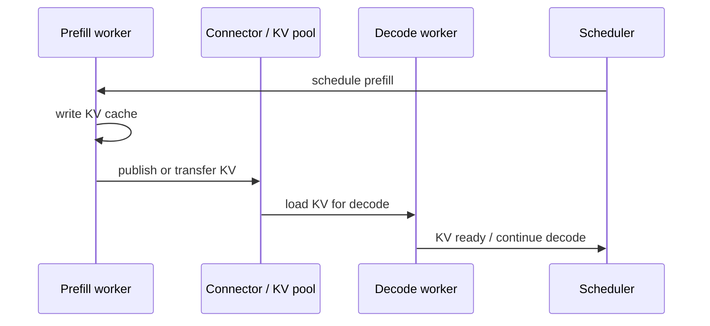

# KV Cache 管理

KV cache 管理是 vLLM 和 vLLM Ascend 的核心能力之一。它决定一个服务能承载多长的上下文、多少并发请求、是否能复用 prefix、是否能做 PD 分离，以及 decode 阶段能否稳定地读到历史 K/V。

## KV Cache 管理管的不是一块普通内存

每个请求生成 token 时，模型每层都会产生 K/V。Decode 需要反复读取历史 K/V，所以 KV cache 既是显存大户，也是性能关键路径。

KV cache 管理至少要解决这些问题：

- 容量：显存里能放多少层、多少 token、多少请求的 K/V。
- 分配：每个请求新增 token 时如何拿到 slot。
- 索引：attention kernel 如何从 block table 找到历史 K/V。
- 释放：请求结束、取消、抢占后如何归还 block。
- 复用：prefix cache 命中后如何复用已有 K/V。
- 传输：PD 分离或 KV pool 中如何跨实例移动 K/V。
- 一致性：scheduler、worker、attention backend、connector 对同一份 K/V 的理解必须一致。

## vLLM 的基础抽象

vLLM 使用 block/page 管理 KV cache。KV payload 本身没有减少，但 block 化管理带来几个好处：

- 按需分配，避免为每个请求按最大上下文预留完整空间。
- 减少动态请求长度带来的外部碎片。
- 支持 prefix cache、copy-on-write、block 复用等能力。
- 让 scheduler 可以把 KV block 作为显式资源参与调度。
- 让 attention backend 通过 block table 找到非连续的历史 K/V。

学习入口：

- `$PATH_TO_VLLM/vllm/v1/core/kv_cache_manager.py`
- `$PATH_TO_VLLM/vllm/v1/kv_cache_interface.py`
- `$PATH_TO_VLLM/docs/design/paged_attention.md`
- `$PATH_TO_VLLM/docs/design/prefix_caching.md`
- `$PATH_TO_VLLM/docs/design/hybrid_kv_cache_manager.md`

建议先理解 `block`、`block table`、`slot mapping`、`cache spec` 这些词，再看具体代码。

## Ascend 侧 Block Table

在 vLLM Ascend 中，scheduler 做出的 KV block 分配结果，需要被 worker/model runner 转换成 NPU attention backend 能消费的结构。这里的关键就是 block table 和 slot mapping。

需要特别注意：

- block table 描述的是逻辑 token 到物理 KV block 的映射。
- slot mapping 描述本轮新 token 的 K/V 应该写到哪里。
- seq lens、query lens、position ids、block table 必须一起对齐。
- Ascend 当前设备亲和的 block size 通常是 128，一般不建议随意修改。
- graph、CP、KV transfer、量化 KV cache 都会让 metadata 更复杂。

代码入口：

- `$PATH_TO_VLLM_ASCEND/vllm_ascend/worker/block_table.py`
- `$PATH_TO_VLLM_ASCEND/vllm_ascend/worker/npu_input_batch.py`
- `$PATH_TO_VLLM_ASCEND/vllm_ascend/worker/model_runner_v1.py`
- `$PATH_TO_VLLM_ASCEND/vllm_ascend/attention`

## Prefix Caching

Prefix caching 的目标是复用公共前缀已经计算好的 KV cache。它对系统的价值很直接：公共 system prompt、RAG 模板、agent 历史上下文等重复前缀越多，prefill 的重复计算就越值得省掉。

但 prefix cache 不是字符串缓存。它通常和 token ids、block hash、模型身份、LoRA、多模态输入、cache salt 等信息有关。两个文本看起来相同，不代表 token 序列和 cache key 一定相同。

排查 prefix cache 时先确认：

- token ids 是否完全一致。
- 前缀长度是否足够覆盖完整 block。
- 相关模型和 adapter 信息是否一致。
- 是否因为内存压力被驱逐。
- 是否与 CP、PD、KV transfer 组合使用。

## KV Offload

KV offload 把部分 KV cache 从 NPU 显存转移到其他介质，常见是 CPU/NPU 之间移动。它的目标是缓解显存压力，但代价是引入传输延迟和同步复杂度。

适合先问：

- offload 的对象是哪些层、哪些请求、哪些 block？
- 什么时候搬出，什么时候搬回？
- decode 需要读取时是否会阻塞？
- 失败或超时如何处理？
- profiler 里传输时间是否超过节省的显存收益？

代码入口：

- `$PATH_TO_VLLM/vllm/v1/kv_offload`
- `$PATH_TO_VLLM_ASCEND/vllm_ascend/kv_offload`
- `$PATH_TO_VLLM_ASCEND/vllm_ascend/distributed/kv_transfer/kv_pool/cpu_offload`

## KV Transfer 和 KV Pool

PD 分离后，prefill 实例生成 KV，decode 实例继续使用 KV。KV transfer 就是把这份 KV 从 producer 交给 consumer。

KV transfer 的正确性依赖：

- producer/consumer role 配置一致。
- layer 顺序、block size、dtype、layout 一致。
- 每个请求的 KV metadata 能被正确传递。
- 传输完成信号和 scheduler 状态一致。
- 网络失败、超时、重试、recompute 策略清楚。

KV pool / Ascend store 更进一步，把 KV cache 放入共享存储或池化系统，支持更多实例之间复用。它会引入 pool scheduler、pool worker、backend、lease、eviction 等问题。

代码入口：

- `$PATH_TO_VLLM/vllm/distributed/kv_transfer`
- `$PATH_TO_VLLM_ASCEND/vllm_ascend/distributed/kv_transfer`
- `$PATH_TO_VLLM_ASCEND/vllm_ascend/distributed/kv_transfer/kv_p2p`
- `$PATH_TO_VLLM_ASCEND/vllm_ascend/distributed/kv_transfer/kv_pool`
- `$PATH_TO_VLLM_ASCEND/docs/source/developer_guide/Design_Documents/KV_Cache_Pool_Guide.md`
- `$PATH_TO_VLLM_ASCEND/docs/source/user_guide/feature_guide/kv_pool.md`

## KV Cache Quantization

KV cache quantization 会改变 KV cache 的 dtype、scale/offset metadata 和 attention backend 读写路径。vLLM Ascend 中可以关注 C8 KV cache 这类路径，但学习时先把它当作“KV cache layout 的一种变化”来理解。

代码入口：

- `$PATH_TO_VLLM_ASCEND/vllm_ascend/quantization/methods/kv_c8.py`
- `$PATH_TO_VLLM_ASCEND/vllm_ascend/attention`
- `$PATH_TO_VLLM_ASCEND/tests/ut/quantization`

## 常见问题

OOM：先看模型权重、max model len、max_num_seqs、max_num_batched_tokens、graph buffer、spec decode 和 KV dtype。

KV block 不足：先看并发、输出长度、请求是否及时释放、prefix cache 是否占用过多 block。

Decode 精度异常：先看 block table、slot mapping、position ids、seq lens、dtype 和 layer 顺序。

KV transfer 失败：先看 producer/consumer role、connector 配置、端口、网络、block size、timeout。

Prefix cache miss：先看 token ids、block hash、模型/LoRA/多模态信息和驱逐。

## 参考入口

- `$PATH_TO_VLLM/vllm/v1/core/kv_cache_manager.py`
- `$PATH_TO_VLLM/vllm/v1/kv_cache_interface.py`
- `$PATH_TO_VLLM/vllm/v1/kv_offload`
- `$PATH_TO_VLLM/vllm/distributed/kv_transfer`
- `$PATH_TO_VLLM_ASCEND/vllm_ascend/worker/block_table.py`
- `$PATH_TO_VLLM_ASCEND/vllm_ascend/kv_offload`
- `$PATH_TO_VLLM_ASCEND/vllm_ascend/distributed/kv_transfer`
- `$PATH_TO_VLLM_ASCEND/vllm_ascend/quantization/methods/kv_c8.py`
- `$PATH_TO_VLLM_ASCEND/tests/ut/kv_connector`
- `$PATH_TO_VLLM_ASCEND/tests/ut/distributed/ascend_store`

## 思考与探索

1. PagedAttention 没有减少每个 token 的 K/V payload，为什么仍然能显著提升服务容量？
2. PD 分离中，如果 prefill 和 decode 的 block size 不一致，会出现什么问题？
3. Prefix cache 命中率高但 TTFT 没明显下降，你会从哪些方向排查？
