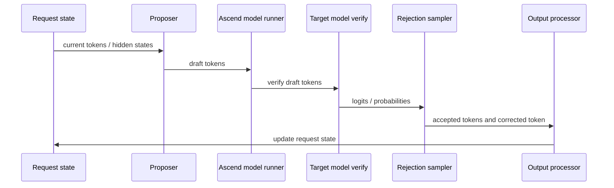

# 投机推理

投机推理的目标是优化 decode：用较便宜的方式先提出多个候选 token，再让目标模型一次性验证。接受率足够高时，目标模型不必严格一轮只推进一个 token，从而降低 TPOT、提升 decode 吞吐。

基础概念可以先回看 [vLLM 投机推理基础](../02-vllm-foundation/09-speculative-decoding.md)。本章重点看 vLLM Ascend 中需要适配的边界。

## 数据流

这条链路有两个关键点：

- Proposer 和 target model 不一定是同一个模型，也不一定走同一种执行路径。
- 接受/拒绝之后，request state、KV cache、position、output token、sampling state 必须保持一致。

## vLLM Ascend 主要适配什么

vLLM Ascend 复用 vLLM 的投机推理框架，同时在 NPU 侧适配：

- proposer：n-gram、NPU n-gram、EAGLE、draft model、suffix、extract hidden states 等。
- NPU 执行：把 draft tokens、verify tokens 和 attention metadata 接到 Ascend model runner。
- rejection sampler：适配 NPU sampling/rejection 路径和必要 patch。
- 模型特殊路径：MTP、DeepSeek/Qwen3 Next 等模型的特殊 proposer 或 head。
- graph：投机推理下 verify token 数可能变成 `(K + 1) * batch`，graph capture size 需要配合。
- KV cache：为 lookahead tokens 预留空间，并在拒绝时保持状态一致。

代码入口：

- `$PATH_TO_VLLM/vllm/v1/spec_decode`
- `$PATH_TO_VLLM/docs/features/speculative_decoding`
- `$PATH_TO_VLLM_ASCEND/vllm_ascend/spec_decode`
- `$PATH_TO_VLLM_ASCEND/vllm_ascend/ops/triton/spec_decode`
- `$PATH_TO_VLLM_ASCEND/vllm_ascend/patch/worker/patch_rejection_sampler.py`
- `$PATH_TO_VLLM_ASCEND/vllm_ascend/patch/worker/patch_qwen3_next_mtp.py`
- `$PATH_TO_VLLM_ASCEND/vllm_ascend/patch/worker/patch_deepseek_mtp.py`

## 常见 proposer

N-gram proposer：从 prompt 或上下文中找重复片段。优点是成本低，不需要额外模型；缺点是适用场景比较依赖文本重复。

EAGLE proposer：基于轻量 draft 模型或辅助结构预测后续 token。优点是通用性更好；缺点是需要额外模型状态、配置和图模式适配。

MTP proposer：模型本身带 Multi Token Prediction 能力时，可以直接产出多个候选 token。它经常和特定模型结构、特定 head、特定 patch 绑定。

Suffix proposer：利用 suffix 匹配提出候选，对代码编辑、重复上下文、agent loop 等场景可能更友好。

Extract hidden states：它不是真正为了加速推理，而是为了抽取目标模型中间 hidden states，通常用于 EAGLE 类 draft 模型的数据准备。

## Graph 和 shape

投机推理和 graph 的关系比较敏感。假设每次 proposer 提出 `K` 个 speculative tokens，target verify 往往需要处理 `K + 1` 个 token，因为还要包含目标模型自身修正位置。batch size 为 `B` 时，verify shape 可能接近 `B * (K + 1)`。

因此需要注意：

- graph capture sizes 是否覆盖目标 batch 和 speculative token 数。
- proposer 和 target verify 是否都能在 graph 下运行。
- 接受 token 数是动态的，不能简单等同于 verify token 数。
- rejection sampler 是否包含 graph 不友好的动态控制流。

Graph 下的问题常表现为 eager 正常、开启 graph 后 shape mismatch、capture 失败或性能没有收益。

## KV Cache 和状态一致性

投机推理会提前为 draft tokens 准备位置。如果 token 被接受，状态前进多个 token；如果某个 token 被拒绝，需要从拒绝位置开始修正。

需要特别关注：

- lookahead KV block 是否足够。
- draft token 的 position ids 是否正确。
- 被拒绝 token 对应的 KV 是否会污染后续状态。
- output processor 是否只输出被接受和修正后的 token。
- scheduler 是否知道请求实际前进了几个 token。

这类 bug 很少只停留在 spec decode 模块内部，经常会牵涉 scheduler、KV manager、model runner 和 sampler。

## 指标

投机推理调优时至少看：

- acceptance rate：接受率。
- num speculative tokens：每轮提出多少 token。
- TPOT / ITL：decode 阶段是否真的变快。
- request throughput / token throughput：整体吞吐是否提升。
- TTFT：额外 proposer 或图捕获是否影响首 token。
- NPU memory：draft model、lookahead KV cache、graph buffer 是否带来额外压力。
- fallback 次数：是否走到预期 NPU proposer 和 sampler 路径。

接受率低时，不要只调大 `num_speculative_tokens`。提出更多 token 可能让验证成本和 KV 预留变大，反而更慢。

## 测试建议

- 单测：proposer 输出、rejection sampler、特殊模型 patch、hidden states 提取。
- 单卡 e2e：n-gram、EAGLE、MTP、suffix 的基本生成路径。
- 多卡 e2e：TP/DP/EP 下 proposer 和 target 是否一致。
- 精度：低随机性配置下对齐 token ids 或 logprobs。
- 性能：对比不开投机推理的 baseline，看接受率、TPOT 和吞吐。

测试入口：

- `$PATH_TO_VLLM_ASCEND/tests/ut/spec_decode`
- `$PATH_TO_VLLM_ASCEND/tests/ut/sample/test_rejection_sampler.py`
- `$PATH_TO_VLLM_ASCEND/tests/e2e/singlecard/spec_decode`
- `$PATH_TO_VLLM_ASCEND/tests/e2e/multicard/2-cards/spec_decode`

## 常见问题

Draft 模型加载失败：看模型路径、TP 配置、draft_tensor_parallel_size、checkpoint 和 tokenizer。

接受率低：看 proposer 质量、采样参数、prompt 类型、draft length 和模型匹配程度。

输出不一致：看 rejection sampler、随机性、token ids、position ids、状态回滚。

Graph capture 失败：看 capture sizes、verify shape、proposer 是否支持 graph。

OOM：看 draft model、lookahead KV cache、graph buffer 和 batch size。

## 参考入口

- `$PATH_TO_VLLM_ASCEND/docs/source/user_guide/feature_guide/speculative_decoding.md`
- `$PATH_TO_VLLM_ASCEND/docs/source/user_guide/feature_guide/Multi_Token_Prediction.md`
- `$PATH_TO_VLLM_ASCEND/docs/source/tutorials/features/suffix_speculative_decoding.md`

## 思考与探索

1. 为什么投机推理提升的是 decode 侧能力，而不是 prefill 的核心优化？
2. 如果接受率很高但吞吐没有提升，可能是哪几个环节抵消了收益？
3. 为什么 rejection sampler 的语义错误会导致“看起来能生成文本，但分布不对”？
